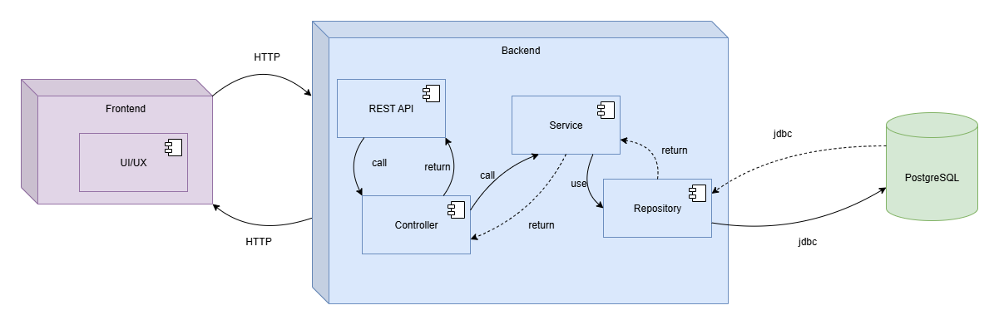
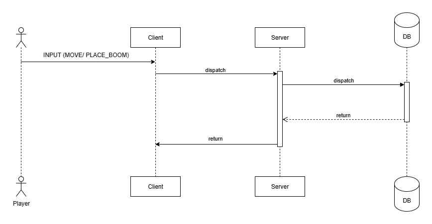

= Boom Blast – Multiplayer Bomberman Clone
:toc:
:toclevels: 3
:sectnums:
:icons: font
:source-highlighter: coderay

== Giới thiệu
Boom Blast là trò chơi lấy cảm hứng từ *Bomberman*, được phát triển theo kiến trúc full-stack web.
Mục tiêu:
* Xây dựng gameplay đặt bom – phá tường – ăn item cơ bản
* Hỗ trợ nhiều người chơi online
* Áp dụng Java 21+, PostgreSQL 17+, MyBatis, WebSocket, Prometheus/Grafana
* Thực hành OOP, SOLID, và Design Patterns trong thiết kế

== Kiến trúc hệ thống
Hệ thống chia thành 2 phần chính: **frontend** (game client) và **backend** (game server).

== Công nghệ sử dụng
* **Frontend**: Phaser 3, Vite, TypeScript
* **Backend**: Java 21+, Spring Boot, Maven, MyBatis, WebSocket
* **Database**: PostgreSQL 17+
* **Monitoring**: Prometheus, Grafana
* **Deploy**: Docker (tùy chọn)

== Yêu cầu hệ thống
* JDK 21+
* Node.js 18+
* PostgreSQL 17+
* Docker (nếu muốn chạy monitoring stack)

== Cấu trúc thư mục
[source]
----
boom-blast/
  frontend/
    src/org/nghlong3004/boombattle/frontend
    index.html
    vite.config.ts
  backend/
    src/main/java/org/nghlong3004/boombattle/backend
    pom.xml
    application.yml
  docs/
    README.adoc
  images/
----

== Thành phần hệ thống
=== Frontend
* Render bản đồ dạng lưới (tilemap)
* Điều khiển người chơi: di chuyển, đặt bom
* WebSocket: gửi INPUT, nhận SNAPSHOT
* Giao diện lobby, leaderboard

=== Backend
* Quản lý phòng chơi (lobby)
* Tick loop (20–30 Hz): bom, nổ, va chạm
* Authoritative server: ngăn cheat, đồng bộ state
* REST API:
- `POST /api/login`
- `GET /api/rooms`
- `POST /api/rooms`
- `GET /api/leaderboard`

=== Database (PostgreSQL + MyBatis)
* `users(id, username, password_hash, created_at)`
* `matches(id, room_id, started_at, ended_at)`
* `leaderboard(user_id, score)`

=== Monitoring
* Spring Boot Actuator + Micrometer export metrics
* Prometheus scrape dữ liệu
* Grafana dashboard: latency, FPS, số phòng, số người chơi

== Machine
Machine được thiết kế với Strategy pattern, mỗi cấp độ triển khai một controller riêng.

=== EASY
* Chọn ngẫu nhiên hướng di chuyển an toàn
* 20% cơ hội đặt bom khi gần tường phá được hoặc đối thủ
* Ưu: đơn giản, nhanh
* Nhược: yếu, dễ đoán

=== NORMAL
* Sử dụng BFS tìm đường ngắn nhất tới mục tiêu an toàn (item, vị trí lợi thế)
* DFS tùy chọn cho hành vi “đuổi sát”
* Hợp với bản đồ nhỏ, mức chơi cân bằng

=== HARD
* A* tìm đường tối ưu với heuristic Manhattan distance
* Tính thêm chi phí rủi ro (danger map) và lợi ích phá tường mềm
* Ưu: khôn, khó đối phó
* Nhược: tốn CPU hơn

=== Logic chung
* Machine chỉ gửi INPUT (MOVE/PLACE_BOMB) → Server quyết định kết quả
* Đặt bom khi:
** Có khả năng nhốt đối thủ
** Có đường chạy thoát trước khi nổ
* Né bom bằng BFS hoặc A* tới ô an toàn gần nhất

== Design Patterns & OOP
=== Strategy
* `MachineController` interface
* Các triển khai: `EasyMachine`, `NormalMachine`, `HardMachine`

=== State
* Quản lý vòng đời game: `MenuState`, `LobbyState`, `InGameState`, `ResultState`

=== Command
* Lưu input (`MoveCommand`, `PlaceBombCommand`) cho replay và test

=== Observer
* Event server (explosion, death) → client subscribe để update UI

=== Factory/Builder
* Tạo `Bomb`, `Explosion`, `Match` theo cấu hình

=== Repository
* `UserRepository`, `MatchRepository` với MyBatis

=== Template Method
* Khung xử lý Machine: `plan() -> evaluate() -> act()`

== Luồng dữ liệu

== Roadmap phát triển
* Sprint 1: Game loop cơ bản (map, player, bomb, explosion)
* Sprint 2: Local multiplayer
* Sprint 3: Backend server với WebSocket + REST API
* Sprint 4: Lobby + leaderboard + PostgreSQL
* Sprint 5: Machine (Easy/Normal/Hard)
* Sprint 6: Monitoring stack (Prometheus + Grafana)
* Sprint 7: Polish UI, asset, âm thanh
